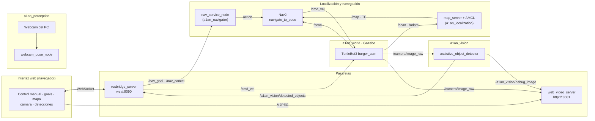
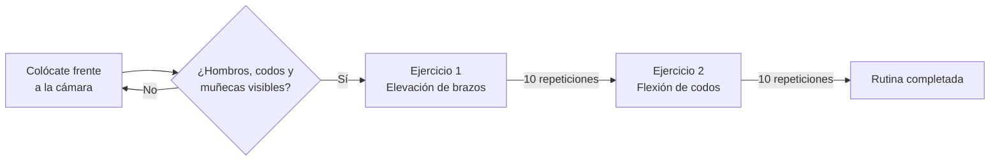

<div align="center">

# A1AN

**Un robot que ayuda en casa a quien ha perdido movilidad.**
Robot asistencial simulado en ROS 2: navega de forma autónoma por una vivienda, localiza objetos cotidianos con su cámara y guía ejercicios de rehabilitación con detección de pose.

[](https://docs.ros.org/en/jazzy/)
[](https://gazebosim.org)
[](https://docs.nav2.org)
[](https://www.python.org)
[](https://opencv.org)
[](https://developers.google.com/mediapipe)

</div>

> Proyecto de Robótica del equipo A1AN (Grupo 2, Safe&Sound Robotics). [Memoria del proyecto](https://drive.google.com/file/d/1wisK82p5xL6m8oBLiKEmlJY0FmWHW7__/view?usp=sharing).

## Índice

- [Qué es](#qué-es)
- [Funcionalidades](#funcionalidades)
- [Arquitectura](#arquitectura)
- [Paquetes ROS 2](#paquetes-ros-2)
- [Topics e interfaz con la web](#topics-e-interfaz-con-la-web)
- [Visión artificial: detección de objetos](#visión-artificial-detección-de-objetos)
- [Rehabilitación con detección de pose](#rehabilitación-con-detección-de-pose)
- [Puesta en marcha](#puesta-en-marcha)
- [Comprobaciones](#comprobaciones)
- [Estructura del repositorio](#estructura-del-repositorio)
- [Decisiones de diseño](#decisiones-de-diseño)
- [Equipo](#equipo)

## Qué es

Las personas con movilidad reducida, temporal o permanente, dependen de otros para tareas tan simples como encontrar el teléfono, acercarse a la medicación o seguir una rutina de ejercicios de recuperación. A1AN es un robot móvil pensado para dar **autonomía y seguridad en el hogar** cubriendo esas tres necesidades.

El proyecto se desarrolla sobre un **TurtleBot3 Burger con cámara** simulado en Gazebo, dentro de una vivienda amueblada. El robot se localiza sobre un mapa de la casa, navega a coordenadas o habitaciones con Nav2, reconoce una botella, un teléfono y una caja de medicinas con visión por color, y acompaña al usuario en ejercicios de brazos usando la webcam del ordenador. Todo se controla desde una interfaz web externa conectada por ROSBridge.

> El robot no sustituye al cuidador: le quita las tareas repetitivas y le da al usuario margen para valerse por sí mismo.

## Funcionalidades

| Área | Qué ofrece |
|---|---|
| **Simulación** | Vivienda `small_house` (AWS RoboMaker) amueblada con 38 modelos de mobiliario y tres objetos de asistencia propios, y el TurtleBot3 `burger_cam` aparecido en `(-2.0, -1.0)`. |
| **Localización** | Mapa estático de la casa servido por `map_server` y localización AMCL con la pose inicial ya configurada; RViz con la vista de navegación. |
| **Navegación autónoma** | Nav2 (planificador global + controlador DWB) con costmaps que evitan obstáculos del LiDAR. Goals por coordenadas `[x, y]` desde la web o desde línea de comandos, y cancelación en cualquier momento. |
| **Detección de objetos** | Reconoce **Botella**, **Teléfono** y **Medicinas** en la imagen de la cámara, publica las detecciones en JSON e imagen anotada con *bounding boxes*. |
| **Rehabilitación** | Rutina de dos ejercicios (elevación de brazos y flexión de codos) con MediaPipe Pose: cuenta repeticiones, corrige asimetrías y muestra el progreso en pantalla. |
| **Control web** | Puente ROSBridge (WebSocket `:9090`) y `web_video_server` (MJPEG `:8081`) para que la interfaz web mueva el robot, envíe goals, vea el mapa, la cámara y las detecciones. |
| **Arranque en un comando** | [`scripts/launch_a1an.sh`](scripts/launch_a1an.sh) levanta los 8 componentes en orden, cada uno en su terminal. |

## Arquitectura



- **Localización y navegación** siguen el esquema estándar de Nav2: `map_server` y `amcl` (con su `lifecycle_manager`) se lanzan aparte de `bt_navigator`, `planner_server` y `controller_server`, ambos con los parámetros de [`param/burger.yaml`](a1an_localization/param/burger.yaml).
- **`nav_service_node`** es el puente entre la web y Nav2: traduce mensajes simples de topic en llamadas al *action server* `navigate_to_pose`, que roslibjs no tendría que gestionar.
- **El vídeo no pasa por ROSBridge**: la web carga el MJPEG directamente de `web_video_server`. Por ROSBridge solo viajan mensajes ligeros (goals, velocidades, mapa y detecciones JSON).
- **La rehabilitación** usa la webcam del ordenador, no la cámara del robot, y abre su propia ventana de OpenCV; su estado se publica en `/a1an/pose_status`.

## Paquetes ROS 2

| Paquete | Tipo | Contenido |
|---|---|---|
| [`a1an`](a1an) | ament_cmake | Metapaquete del proyecto. |
| [`a1an_world`](a1an_world) | ament_cmake | Launch de Gazebo, mundo [`small_house_fixed.world`](a1an_world/worlds/small_house_fixed.world) y modelos (muebles y objetos de asistencia). |
| [`a1an_localization`](a1an_localization) | ament_python | Mapa de la casa, parámetros de AMCL/Nav2, launch de localización con RViz. |
| [`a1an_navigator`](a1an_navigator) | ament_python | Launch de Nav2 y los nodos `nav_service_node` y `nav_to_pose`. |
| [`a1an_vision`](a1an_vision) | ament_python | `assistive_object_detector` (detección por color) y `camera_viewer` (visor de depuración). |
| [`a1an_perception`](a1an_perception) | ament_python | `webcam_pose_node`: rehabilitación con MediaPipe Pose. |

### Ejecutables y launch files

| Comando | Qué hace |
|---|---|
| `ros2 launch a1an_world a1an_world.launch.py` | Gazebo con la casa y el robot `burger_cam`. |
| `ros2 launch a1an_localization my_map_server.launch.py` | `map_server`, `amcl`, `lifecycle_manager` y RViz. |
| `ros2 launch a1an_navigator navigation.launch.py` | Stack de navegación de Nav2 (`nav2_bringup`). |
| `ros2 run a1an_navigator nav_service_node` | Escucha `/nav_goal` y `/nav_cancel` y los envía a Nav2. |
| `ros2 run a1an_navigator nav_to_pose <x> <y>` | Envía un único goal desde la terminal y termina al llegar. |
| `ros2 launch a1an_vision vision.launch.py` | Detector de objetos sobre `/camera/image_raw`. |
| `ros2 run a1an_vision camera_viewer` | Muestra en una ventana la imagen de la cámara del robot. |
| `ros2 launch a1an_perception webcam_pose.launch.py` | Rutina de rehabilitación con la webcam. |

## Topics e interfaz con la web

La interfaz web se conecta a `ws://localhost:9090` (o `ws://IP_DEL_PC_ROS:9090` desde otro equipo) y usa estos topics y streams:

| Topic / URL | Tipo | Sentido | Uso |
|---|---|---|---|
| `/nav_goal` | `std_msgs/Float64MultiArray` | web → robot | Goal `[x, y]` en el frame `map`. |
| `/nav_cancel` | `std_msgs/Bool` | web → robot | `true` cancela la navegación activa. |
| `/cmd_vel` | velocidad | web → robot | Control manual. |
| `/map` | `nav_msgs/OccupancyGrid` | robot → web | Plano de la casa para dibujarlo en la web. |
| `/a1an_vision/detected_objects` | `std_msgs/String` (JSON) | robot → web | Detecciones de objetos. |
| `/a1an_vision/status` | `std_msgs/String` | robot → web | Mensaje de estado legible de la detección. |
| `/a1an/pose_status` | `std_msgs/String` | rehab → web | Ejercicio, repeticiones, estado y feedback. |
| `:8081/stream?topic=/camera/image_raw&type=mjpeg` | MJPEG | robot → web | Cámara del robot. |
| `:8081/stream?topic=/a1an_vision/debug_image&type=mjpeg` | MJPEG | robot → web | Cámara con las detecciones dibujadas. |

`localhost` solo sirve si el navegador está en el mismo ordenador que ROS 2; desde la web desplegada u otro equipo hay que usar la IP de ese ordenador.

El campo `data` de `/a1an_vision/detected_objects` contiene un JSON con esta forma:

```json
{
  "detected": true,
  "message": "Objetos relevantes detectados",
  "image_width": 320,
  "image_height": 240,
  "objects": [
    {
      "label": "Botella",
      "confidence": 1.0,
      "center_x": 160,
      "center_y": 120,
      "bbox": [120, 60, 50, 120],
      "position": "centro-centro"
    }
  ]
}
```

`label` es `Botella`, `Telefono` o `Medicinas`; `bbox` es `[x, y, ancho, alto]` en píxeles, y `position` combina la fila (`arriba`, `centro`, `abajo`) y la columna (`izquierda`, `centro`, `derecha`) de una cuadrícula 3×3 sobre la imagen.

## Visión artificial: detección de objetos

[`assistive_object_detector.py`](a1an_vision/a1an_vision/assistive_object_detector.py) procesa uno de cada `process_every_n_frames` fotogramas (2 por defecto) y, para cada objeto objetivo:

1. Convierte la imagen a HSV y crea una máscara con el rango de color del objeto.
2. Limpia la máscara con operaciones morfológicas (apertura, cierre, dilatación).
3. Recorre los contornos de mayor a menor área y se queda con el primero que cumple los filtros de forma, tamaño, posición y contexto.

| Objeto | Color (H) | Filtros que lo distinguen |
|---|---|---|
| **Botella** | 95–135 (azul) | Área ≥ 120 px², alargada en vertical (ancho/alto ≤ 0,85). |
| **Teléfono** | 75–110 (pantalla cian) | Área ≥ 8 px², apaisado (ancho/alto ≥ 1,1). |
| **Medicinas** | 45–85 (cruz verde) | Área ≥ 6 px², en la mitad inferior de la imagen, no más del 28 % de ancho ni 45 % de alto y rodeada al menos en un 35 % de fondo claro (la caja es blanca). |

La confianza es proporcional al área del contorno y se satura en 1:

```text
confidence = min(1, área / (min_area · 8))
```

Ejemplo: una botella (`min_area = 120`) con un contorno de 480 px² da `480 / 960 = 0,5` → 50 %; a partir de 960 px² marca 100 %.

## Rehabilitación con detección de pose

[`webcam_pose_node.py`](a1an_perception/a1an_perception/webcam_pose_node.py) abre la webcam, estima la pose con MediaPipe y guía una rutina de dos ejercicios con `target_repetitions` repeticiones cada uno (10 por defecto):



| Ejercicio | Cuenta una repetición cuando… | Se rearma cuando… |
|---|---|---|
| **Elevación de brazos** | Ambas muñecas suben por encima de la línea de hombros (margen 0,06) con los codos también arriba. | Ambas muñecas bajan por debajo de los hombros. |
| **Flexión de codos** | Ambas muñecas quedan por encima de sus codos, sin levantar los codos por encima de los hombros. | Ambos brazos vuelven a extenderse. |

Si solo trabaja un brazo, la ventana avisa de que hay que hacerlo de forma simétrica. Cada repetición se cuenta una sola vez gracias a un indicador de "movimiento activo" que solo se rearma al volver a la posición de reposo. Con anchos de imagen de 900 px o más se dibuja un panel lateral (progreso, feedback y seguimiento); por debajo, un panel compacto.

| Tecla | Acción |
|---|---|
| `q` | Salir. |
| `e` | Reiniciar el ejercicio actual. |
| `r` | Reiniciar toda la rutina. |

Parámetros del launch: `camera_index` (0; `-1` prueba los índices 0–9 y usa la primera webcam que entregue imagen), `mirror_image` (`true`), `model_complexity` (1), `frame_width`×`frame_height` (1024×768), `camera_fps` (15), `camera_fourcc` (`MJPG`) y `target_repetitions` (10).

```bash
ros2 launch a1an_perception webcam_pose.launch.py camera_index:=-1 target_repetitions:=5
```

## Puesta en marcha

### Requisitos

- Ubuntu 24.04 con **ROS 2 Jazzy** y Gazebo.
- Un workspace en `~/turtlebot3_ws` con los paquetes de TurtleBot3, incluido `turtlebot3_gazebo` (el script de arranque usa esa ruta).
- Nav2, ROSBridge, `web_video_server` y `cv_bridge`.
- Una webcam para la rehabilitación.

### Instalación

```bash
# 1. Clonar dentro del workspace de TurtleBot3
cd ~/turtlebot3_ws/src
git clone https://github.com/ALANGMupv/a1an.git

# 2. Dependencias de ROS 2
sudo apt install ros-jazzy-navigation2 ros-jazzy-nav2-bringup ros-jazzy-rosbridge-suite ros-jazzy-web-video-server ros-jazzy-cv-bridge

# 3. Dependencias Python de la rehabilitación (versiones compatibles entre sí)
python3 -m pip install --user --break-system-packages "numpy==1.26.4" "opencv-python==4.10.0.84" "mediapipe==0.10.14"

# 4. Compilar y cargar el entorno
cd ~/turtlebot3_ws
colcon build
source install/setup.bash
```

### Ejecución con un solo comando

```bash
cd ~/turtlebot3_ws
source install/setup.bash
./src/a1an/scripts/launch_a1an.sh
```

⚠️ El script empieza cerrando cualquier proceso de Gazebo que esté abierto. Después abre una terminal (`gnome-terminal`) por componente, con pausas entre ellos para respetar las dependencias: Gazebo → localización → Nav2 → `nav_service_node` → ROSBridge → detector de objetos → `web_video_server` → rehabilitación.

### Ejecución manual

Una terminal por componente, con `source install/setup.bash` en cada una y en este orden:

```bash
ros2 launch a1an_world a1an_world.launch.py
ros2 launch a1an_localization my_map_server.launch.py
ros2 launch a1an_navigator navigation.launch.py
ros2 run a1an_navigator nav_service_node
ros2 launch rosbridge_server rosbridge_websocket_launch.xml delay_between_messages:=0.0
ros2 launch a1an_vision vision.launch.py
ros2 run web_video_server web_video_server --ros-args -p port:=8081
ros2 launch a1an_perception webcam_pose.launch.py
```

Para mandar el robot a un punto sin la web:

```bash
ros2 run a1an_navigator nav_to_pose 1.5 -0.8
```

## Comprobaciones

| Qué comprobar | Comando o URL |
|---|---|
| El mapa se publica (si la web no lo dibuja) | `ros2 topic echo /map --once` → lista de valores `-1`, `0` y `100`. |
| La cámara del robot está activa | `ros2 topic list \| grep camera` → `/camera/camera_info` y `/camera/image_raw`. |
| El stream de cámara funciona | `http://localhost:8081/snapshot?topic=/camera/image_raw` |
| El detector publica | `ros2 topic echo /a1an_vision/detected_objects` |
| La imagen anotada llega | `http://localhost:8081/stream?topic=/a1an_vision/debug_image&type=mjpeg` |
| La rehabilitación publica su estado | `ros2 topic echo /a1an/pose_status` |
| Enviar un goal a mano | `ros2 topic pub --once /nav_goal std_msgs/msg/Float64MultiArray "{data: [1.5, -0.8]}"` |

## Estructura del repositorio

```text
a1an/
├── a1an/                     # Metapaquete
├── a1an_world/
│   ├── launch/               # a1an_world.launch.py: Gazebo + robot burger_cam
│   ├── worlds/               # small_house_fixed.world (mundo que se lanza)
│   ├── models/               # Muebles AWS RoboMaker y objetos a1an_assistive_*
│   └── urdf/                 # Descripciones del TurtleBot3 Burger (con y sin cámara)
├── a1an_localization/
│   ├── launch/               # my_map_server.launch.py: map_server + AMCL + RViz
│   ├── map/                  # my_map.pgm / my_map.yaml (resolución 5 cm)
│   ├── param/                # burger.yaml: parámetros de AMCL y Nav2
│   └── rviz/                 # Configuración de RViz para navegación
├── a1an_navigator/
│   ├── launch/               # navigation.launch.py: Nav2
│   └── a1an_navigator/       # nav_service_node.py, nav_to_pose.py
├── a1an_vision/
│   ├── launch/               # vision.launch.py
│   └── a1an_vision/          # assistive_object_detector.py, camera_viewer.py
├── a1an_perception/
│   ├── launch/               # webcam_pose.launch.py
│   └── a1an_perception/      # webcam_pose_node.py
├── a1an_documentacion/       # Documento de concepción (Sprint 0) y estructura
└── scripts/launch_a1an.sh    # Arranque completo en 8 terminales
```

## Decisiones de diseño

- **Topics en vez de acciones hacia la web.** La web publica `[x, y]` en `/nav_goal` y `nav_service_node` se ocupa del *action client* de Nav2 (espera al servidor, feedback, cancelación). Así la web solo necesita publicar mensajes simples por ROSBridge.
- **Vídeo fuera de ROSBridge.** Enviar imágenes por WebSocket en JSON es costoso; `web_video_server` las sirve como MJPEG que el navegador muestra directamente en una etiqueta de imagen.
- **Detección por color en lugar de un modelo entrenado.** En una simulación con objetos propios de colores controlados, umbrales HSV y filtros geométricos son deterministas, ligeros y fáciles de ajustar. Botella y teléfono comparten parte del rango de color y se separan por proporción (vertical frente a apaisado); la caja de medicinas se distingue exigiendo fondo claro alrededor, para no confundirla con otros elementos verdes de la casa.
- **Procesar uno de cada dos fotogramas.** El detector publica a la mitad de frecuencia que la cámara, suficiente para una interfaz y con la mitad de carga de CPU.
- **Objetos de asistencia propios.** `a1an_assistive_bottle` (azul), `_phone` (pantalla cian) y `_medicine_box` (caja blanca con cruz verde) se modelaron con colores pensados para la detección, en vez de depender de los muebles genéricos del mundo.
- **Pose inicial coherente.** El robot aparece en `(-2.0, -1.0)` y AMCL arranca con esa misma pose en `burger.yaml`, de modo que la navegación funciona sin tener que fijarla a mano en RViz.
- **Rehabilitación con la webcam del PC.** Los ejercicios se hacen frente al ordenador, donde está el usuario; MediaPipe Pose corre en CPU y no necesita GPU ni entrenamiento.
- **Repeticiones con histéresis.** Una repetición se cuenta al alcanzar la postura objetivo y no vuelve a contar hasta regresar a la posición de reposo, con márgenes sobre la línea de hombros para evitar dobles conteos por pequeñas oscilaciones.
- **Feedback correctivo, no solo un contador.** El nodo detecta el movimiento asimétrico (un solo brazo) y pide corregirlo, porque en rehabilitación la calidad del gesto importa tanto como el número de repeticiones.

## Equipo

- Alan Guevara
- Santiago Fuenmayor
- Nerea Aguilar
- Alejandro Vázquez
- Judit Espinoza

<div align="center">

A1AN · Safe&Sound Robotics · Proyecto de Robótica

</div>
